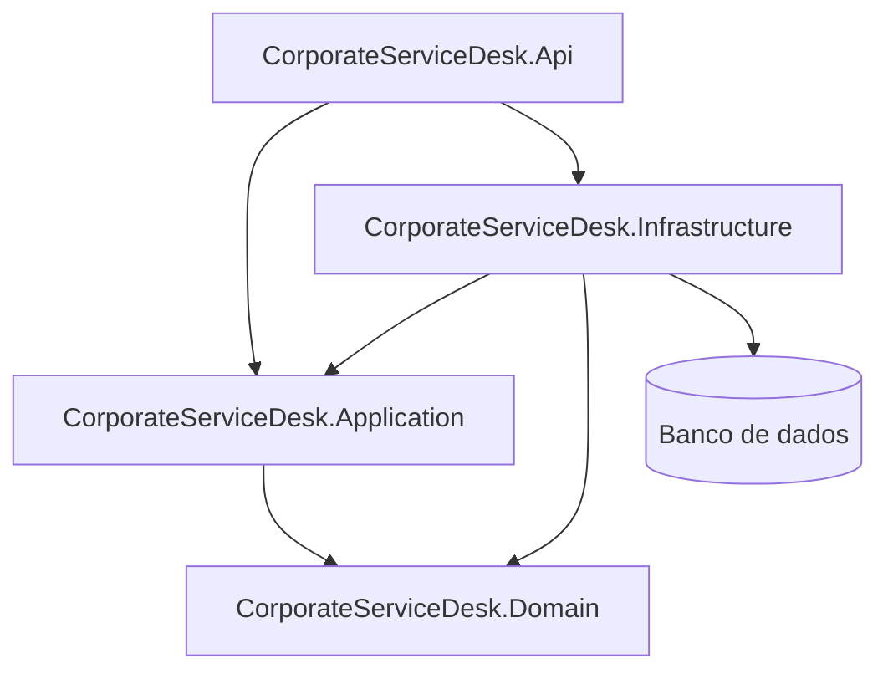
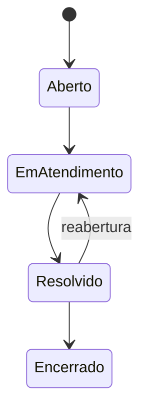

# Corporate Service Desk API


API corporativa de referência para gerenciamento de chamados internos.

O projeto está sendo desenvolvido como um laboratório de Engenharia de Software e item de portfólio, com foco em organização, segurança, testabilidade, documentação e decisões arquiteturais conscientes.

> O objetivo não é construir um sistema enorme. O objetivo é demonstrar como estruturar e evoluir uma API corporativa de forma profissional.

---

## Status do projeto

O projeto está em desenvolvimento incremental.

### Implementado e validado

- [x] Solution .NET 8;
- [x] ASP.NET Core Web API com Controllers;
- [x] Swagger/OpenAPI;
- [x] Estrutura física com diretórios `src` e `tests`;
- [x] Projeto `Domain`;
- [x] Projeto `Application`;
- [x] Referência `Application → Domain`;
- [x] Nullable Reference Types;
- [x] Suporte inicial a Docker;
- [x] Compilação da solution;
- [x] Execução da API em container;
- [x] Smoke test HTTP com resposta `200 OK`.

### Em andamento

- [ ] Criação da camada `Infrastructure`;
- [ ] Definição do primeiro fluxo funcional de chamados;
- [ ] Modelagem inicial do domínio.

---

## Problema

Em muitas empresas, solicitações internas são registradas por e-mail, mensagens ou conversas informais.

Esse modelo dificulta:

- acompanhar o andamento das solicitações;
- definir responsabilidades;
- localizar chamados antigos;
- registrar decisões e comentários;
- controlar o acesso às informações;
- medir o processo de atendimento.

A Corporate Service Desk API pretende centralizar esse fluxo e fornecer uma base para interfaces web, aplicativos ou integrações corporativas.

---

## Objetivo

Construir uma API REST em .NET 8 que demonstre:

- separação de responsabilidades;
- arquitetura em camadas;
- regras de negócio protegidas;
- autenticação e autorização;
- persistência com Entity Framework Core;
- consultas paginadas e filtradas;
- tratamento padronizado de erros;
- logs estruturados;
- testes automatizados;
- execução em containers;
- integração contínua.

---

## Usuários previstos

### Solicitante

Funcionário que registra e acompanha chamados.

Responsabilidades previstas:

- abrir chamados;
- consultar os próprios chamados;
- acompanhar o andamento;
- adicionar comentários.

### Atendente

Profissional responsável pelo tratamento das solicitações.

Responsabilidades previstas:

- consultar chamados disponíveis;
- assumir chamados;
- alterar prioridade e status;
- registrar comentários técnicos;
- resolver chamados.

### Administrador

Responsável pela administração da aplicação.

Responsabilidades previstas:

- gerenciar usuários;
- gerenciar perfis;
- associar permissões;
- visualizar todos os chamados;
- executar operações administrativas.

---

## Escopo funcional planejado

### Autenticação e autorização

- login com usuário e senha;
- geração e validação de JWT;
- perfis de acesso;
- permissões;
- autorização baseada em policies;
- bloqueio de usuários inativos.

### Gestão de chamados

- abertura de chamado;
- consulta por identificador;
- listagem paginada;
- atribuição a um atendente;
- alteração de prioridade;
- alteração de status;
- inclusão de comentários;
- histórico de alterações relevantes.

### Consultas

- paginação;
- ordenação;
- filtro por status;
- filtro por prioridade;
- filtro por solicitante;
- filtro por atendente;
- filtro por período;
- pesquisa textual.

### Qualidade técnica

- logs estruturados;
- tratamento global de exceções;
- respostas com Problem Details;
- Swagger/OpenAPI;
- testes unitários;
- testes de integração;
- Docker;
- pipeline de integração contínua;
- health checks.

---

## Fora do escopo inicial

Os seguintes recursos não fazem parte do primeiro MVP:

- anexos;
- envio de e-mails;
- notificações em tempo real;
- dashboards;
- relatórios avançados;
- SLA;
- múltiplas empresas ou tenants;
- login social;
- Active Directory;
- recuperação de senha;
- refresh tokens;
- mensageria;
- microsserviços.

Esses itens poderão ser avaliados posteriormente conforme necessidades reais.

---

## Arquitetura

O projeto utiliza uma arquitetura em camadas com dependências direcionadas para o núcleo da aplicação.

### Arquitetura-alvo



### Regra de dependência

As camadas externas podem depender das camadas internas.

As camadas internas não devem conhecer detalhes de frameworks, bancos de dados ou mecanismos de entrega.

```text
Api → Application
Api → Infrastructure

Infrastructure → Application
Infrastructure → Domain

Application → Domain

Domain → nenhuma camada do sistema
```

---

## Responsabilidade das camadas

### CorporateServiceDesk.Domain

Contém o núcleo das regras de negócio.

Responsabilidades previstas:

- entidades;
- objetos de valor;
- enums de negócio;
- invariantes;
- transições de estado;
- exceções de domínio;
- eventos de domínio, quando necessários.

O projeto `Domain` não deve depender de:

- ASP.NET Core;
- Entity Framework Core;
- banco de dados;
- JWT;
- Swagger;
- `HttpContext`;
- `DbContext`;
- implementações externas.

### CorporateServiceDesk.Application

Contém os casos de uso da aplicação.

Responsabilidades previstas:

- comandos e consultas;
- casos de uso;
- contratos internos;
- interfaces para dependências externas;
- DTOs de aplicação;
- paginação;
- orquestração;
- validações relacionadas aos casos de uso.

A camada `Application` conhece o `Domain`, mas não conhece implementações de infraestrutura.

### CorporateServiceDesk.Infrastructure

Camada planejada para os detalhes técnicos.

Responsabilidades previstas:

- Entity Framework Core;
- `DbContext`;
- configurações de entidades;
- migrations;
- persistência;
- implementação de repositórios;
- geração de JWT;
- hash de senhas;
- integrações externas.

Essa camada ainda será criada.

### CorporateServiceDesk.Api

Ponto de entrada HTTP e ponto de composição da aplicação.

Responsabilidades:

- controllers;
- contratos HTTP;
- model binding;
- autenticação;
- autorização;
- Swagger;
- configuração de middlewares;
- registro das dependências;
- serialização;
- respostas HTTP.

Regras de negócio não devem ser implementadas nos controllers ou no `Program.cs`.

---

## Estrutura atual

```text
CorporateServiceDesk/
├── CorporateServiceDesk.sln
├── README.md
├── src/
│   ├── CorporateServiceDesk.Api/
│   │   ├── Controllers/
│   │   ├── Properties/
│   │   ├── Dockerfile
│   │   ├── Program.cs
│   │   └── CorporateServiceDesk.Api.csproj
│   │
│   ├── CorporateServiceDesk.Application/
│   │   └── CorporateServiceDesk.Application.csproj
│   │
│   └── CorporateServiceDesk.Domain/
│       └── CorporateServiceDesk.Domain.csproj
│
└── tests/
```

### Estrutura planejada

```text
CorporateServiceDesk/
├── src/
│   ├── CorporateServiceDesk.Api/
│   ├── CorporateServiceDesk.Application/
│   ├── CorporateServiceDesk.Domain/
│   └── CorporateServiceDesk.Infrastructure/
│
└── tests/
    ├── CorporateServiceDesk.UnitTests/
    └── CorporateServiceDesk.IntegrationTests/
```

---

## Tecnologias

### Em uso

- C#;
- .NET 8;
- ASP.NET Core Web API;
- Controllers;
- Swagger/OpenAPI;
- Docker;
- Visual Studio 2022.

### Planejadas

- Entity Framework Core;
- PostgreSQL ou SQL Server;
- JWT Bearer;
- autorização baseada em policies;
- `ILogger`;
- Problem Details;
- xUnit;
- biblioteca de mocks, quando necessária;
- Docker Compose;
- pipeline de integração contínua.

A escolha definitiva do banco e da plataforma de pipeline será registrada como decisão técnica.

---

## Pré-requisitos

Para executar o estado atual do projeto:

- .NET 8 SDK;
- Visual Studio 2022 com suporte ao ASP.NET Core;
- Docker Desktop, para execução pelo perfil de container;
- Git.

Verifique o SDK instalado:

```bash
dotnet --version
```

Verifique o Docker:

```bash
docker --version
```

---

## Executando sem Docker

Na raiz do repositório, execute:

```bash
dotnet restore
```

O comando restaura as dependências NuGet da solution.

Compile o projeto:

```bash
dotnet build
```

Execute a API:

```bash
dotnet run --project src/CorporateServiceDesk.Api/CorporateServiceDesk.Api.csproj
```

O endereço utilizado será exibido no terminal.

Acesse o Swagger pela URL indicada pela aplicação, acrescentando:

```text
/swagger
```

Exemplo:

```text
https://localhost:<porta>/swagger
```

---

## Executando pelo Visual Studio

1. Abra `CorporateServiceDesk.sln`;
2. Defina `CorporateServiceDesk.Api` como projeto de inicialização;
3. Selecione o perfil de execução com Docker;
4. Inicie com `F5` ou `Ctrl + F5`;
5. Aguarde a abertura do Swagger;
6. Execute o endpoint temporário `GET /WeatherForecast`.

---

## Build da imagem Docker

Execute na pasta onde está o arquivo `CorporateServiceDesk.sln`:

```bash
docker build \
  -f src/CorporateServiceDesk.Api/Dockerfile \
  -t corporate-service-desk-api:local \
  .
```

No PowerShell:

```powershell
docker build `
  -f src/CorporateServiceDesk.Api/Dockerfile `
  -t corporate-service-desk-api:local `
  .
```

O ponto final representa o contexto de build e deve ser mantido.

---

## Smoke test atual

O endpoint abaixo pertence ao template inicial e será removido quando o primeiro fluxo real estiver disponível.

```http
GET /WeatherForecast
```

Resultado esperado:

```http
HTTP/1.1 200 OK
Content-Type: application/json
```

Exemplo de resposta:

```json
[
  {
    "date": "2026-07-17",
    "temperatureC": 16,
    "temperatureF": 60,
    "summary": "Freezing"
  }
]
```

Esse endpoint é utilizado apenas para validar:

- inicialização da aplicação;
- roteamento;
- controllers;
- serialização JSON;
- Swagger;
- comunicação com o container.

---

## Regras iniciais do domínio

As regras ainda serão refinadas durante a descoberta do domínio.

Hipóteses iniciais:

1. Todo chamado possui um solicitante.
2. Um chamado novo inicia com status `Aberto`.
3. Apenas usuários autorizados visualizam chamados de terceiros.
4. Apenas atendentes ou administradores podem assumir chamados.
5. Um chamado precisa ser resolvido antes de ser encerrado.
6. Usuários inativos não podem autenticar-se.
7. Mudanças relevantes devem registrar data e responsável.

As hipóteses serão transformadas em regras somente após validação durante a modelagem.

---

## Fluxo de status proposto



As transições serão protegidas pelo domínio e não ficarão espalhadas nos controllers.

---

## Segurança planejada

- armazenamento de senha com algoritmo de hash adequado;
- JWT com configuração externa;
- segredos fora do repositório;
- autorização no servidor;
- policies reutilizáveis;
- validação de acesso ao recurso;
- ausência de tokens e senhas nos logs;
- respostas sem stack traces;
- validação de entrada;
- limitação de informações sensíveis;
- configuração de CORS conforme os clientes reais.

---

## Estratégia de testes

### Testes unitários

Cobrirão principalmente:

- regras do domínio;
- transições de status;
- invariantes;
- casos de uso;
- validações;
- cenários de erro.

Os testes unitários não dependerão de banco ou rede.

### Testes de integração

Cobrirão principalmente:

- endpoints;
- pipeline HTTP;
- autenticação;
- autorização;
- serialização;
- Entity Framework Core;
- banco de dados;
- respostas de erro;
- paginação e filtros.

### Testes de arquitetura

Poderão validar:

- ausência de dependência do `Domain` para outras camadas;
- ausência de dependência da `Application` para `Infrastructure`;
- convenções estruturais importantes.

---

## Decisões técnicas

### Uso do .NET 8

O projeto foi iniciado em .NET 8 conforme o objetivo do laboratório.

### Uso de Controllers

Controllers foram escolhidos por oferecerem uma estrutura explícita para:

- contratos HTTP;
- autorização;
- filtros;
- model binding;
- documentação;
- organização por recurso.

### Arquitetura em camadas

A separação foi escolhida para proteger regras de negócio de detalhes técnicos e permitir testes nos limites de maior risco.

O projeto não pretende criar uma abstração para cada classe. Novas interfaces serão adicionadas somente quando houver um limite de dependência ou necessidade real.

### Docker desde a fundação

O suporte a containers foi configurado no início para validar a execução em ambiente Linux e reduzir diferenças entre ambientes.

### Sem microsserviços

O escopo atual não justifica microsserviços.

A aplicação será inicialmente um monólito com limites internos claros.

### Sem CQRS ou MediatR inicialmente

Esses padrões e ferramentas não serão adicionados apenas por convenção.

A adoção dependerá de problemas concretos relacionados à complexidade, separação entre leitura e escrita ou organização dos casos de uso.

### Sem repositório genérico por padrão

O projeto não criará um repositório genérico apenas para encapsular o Entity Framework Core.

As abstrações de persistência serão definidas conforme as necessidades reais dos casos de uso.

---

## Roadmap

### Fundação

- [x] Criar solution;
- [x] Criar Web API;
- [x] Configurar Swagger;
- [x] Configurar Docker;
- [x] Criar Domain;
- [x] Criar Application;
- [ ] Criar Infrastructure;
- [ ] Criar projetos de testes.

### Primeiro fluxo vertical

- [ ] Modelar a entidade `Ticket`;
- [ ] Criar um chamado;
- [ ] Consultar chamado por identificador;
- [ ] Persistir com Entity Framework Core;
- [ ] Expor endpoints reais;
- [ ] Remover `WeatherForecast`.

### Segurança

- [ ] Modelar usuários;
- [ ] Implementar hash de senha;
- [ ] Implementar login;
- [ ] Gerar JWT;
- [ ] Implementar perfis;
- [ ] Implementar permissões;
- [ ] Criar policies.

### Consultas

- [ ] Paginação;
- [ ] Filtros;
- [ ] Ordenação;
- [ ] Limite máximo por página;
- [ ] Consultas sem tracking quando aplicável.

### Operação

- [ ] Tratamento global de exceções;
- [ ] Problem Details;
- [ ] Logs estruturados;
- [ ] Correlation ID;
- [ ] Health checks;
- [ ] Docker Compose;
- [ ] Pipeline.

### Portfólio

- [ ] Diagrama arquitetural final;
- [ ] Exemplos de request e response;
- [ ] Evidências dos testes;
- [ ] Prints da aplicação;
- [ ] ADRs;
- [ ] Limitações;
- [ ] Estudo de caso SAR.

---

## Limitações atuais

O projeto ainda não possui:

- funcionalidade real de chamados;
- camada de infraestrutura;
- banco de dados;
- autenticação;
- autorização;
- testes automatizados;
- pipeline;
- deploy;
- observabilidade completa.

O endpoint `WeatherForecast` ainda é apenas o exemplo criado pelo template do ASP.NET Core.

---

## Melhorias futuras

Após a conclusão do MVP, poderão ser avaliados:

- anexos;
- categorias configuráveis;
- departamentos;
- SLA;
- auditoria;
- notificações;
- recuperação de senha;
- refresh tokens;
- dashboards;
- integração com outros sistemas;
- cache;
- mensageria;
- observabilidade distribuída.

Cada melhoria será avaliada considerando benefício, custo, risco e complexidade adicionada.

---

## Estudo de caso — SAR

### Situação

O objetivo é criar uma API corporativa de referência que demonstre organização técnica e capacidade de evolução, sem transformar o projeto em um sistema excessivamente grande.

### Ação

Foi iniciada uma solution .NET 8 com ASP.NET Core Web API, separação inicial entre `Api`, `Application` e `Domain`, suporte a Docker e validação pelo Swagger.

As dependências começaram a ser organizadas para manter regras de negócio separadas dos detalhes técnicos.

### Resultado parcial

A solution compila, a API executa em container e o endpoint inicial responde com `200 OK`.

As funcionalidades de negócio ainda serão implementadas e os resultados finais serão documentados somente após validação.

---

## Convenção de commits

O projeto poderá utilizar Conventional Commits:

```text
feat: nova funcionalidade
fix: correção de defeito
refactor: alteração estrutural sem mudar comportamento
test: criação ou alteração de testes
docs: documentação
build: build ou dependências
ci: pipeline
chore: manutenção
```

Exemplos:

```text
chore(architecture): add application project
docs: add initial project readme
feat(tickets): add ticket creation use case
test(tickets): cover invalid status transition
```

---

## Autor

**Peterson Benhame**

Projeto desenvolvido como laboratório prático de Engenharia de Software, arquitetura e desenvolvimento de APIs corporativas com .NET.