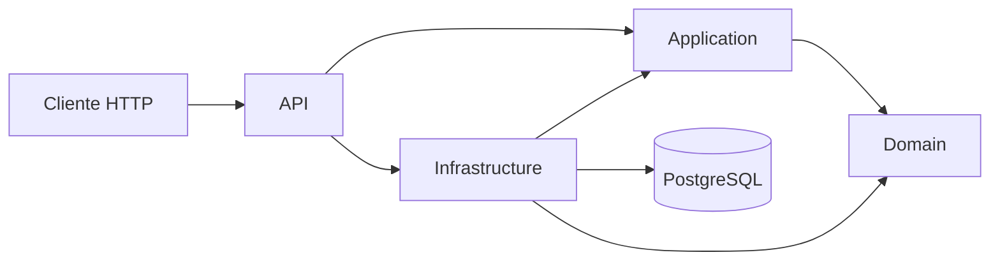
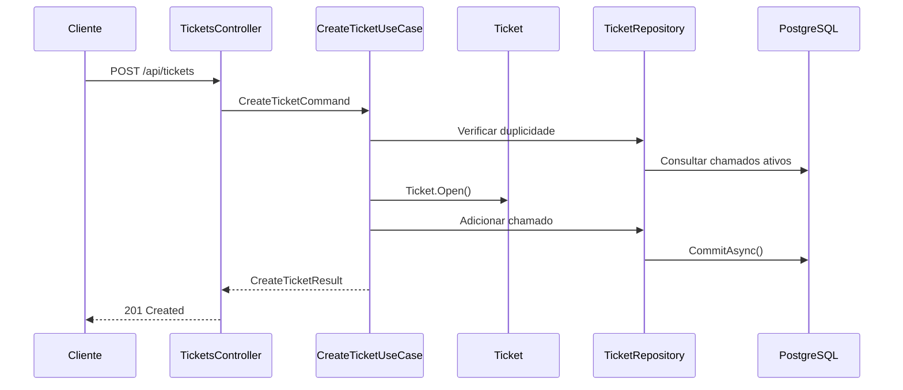
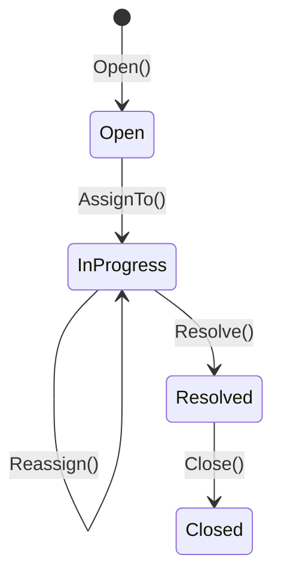

# Corporate Service Desk API


# Corporate Service Desk API

[](https://github.com/Peterson-Benhame/CorporateServiceDesk/actions/workflows/ci.yml)


API REST para gerenciamento de chamados corporativos, desenvolvida com .NET 8, ASP.NET Core, Entity Framework Core e PostgreSQL.

O projeto demonstra a construção de um backend corporativo completo, desde a modelagem de domínio até testes automatizados, containers, migrations, integração contínua e deploy em produção.

## Demonstração

| Recurso      | Endereço                                                                                       |
| ------------ | ---------------------------------------------------------------------------------------------- |
| API          | [corporateservicedesk.onrender.com](https://corporateservicedesk.onrender.com)                 |
| Swagger      | [corporateservicedesk.onrender.com/swagger](https://corporateservicedesk.onrender.com/swagger) |
| Health check | [corporateservicedesk.onrender.com/health](https://corporateservicedesk.onrender.com/health)   |
| Pipeline     | [GitHub Actions](https://github.com/Peterson-Benhame/CorporateServiceDesk/actions)             |

> A disponibilidade do ambiente de demonstração depende do status atual do serviço no Render.

---

## Sobre o projeto

Em muitas empresas, solicitações internas ainda são registradas por e-mail, mensagens ou planilhas. Isso dificulta o acompanhamento dos chamados, a definição de responsáveis e a rastreabilidade das alterações.

A Corporate Service Desk API centraliza esse processo e fornece uma base para:

* abertura e acompanhamento de chamados;
* pesquisa com filtros simples e avançados;
* atribuição de responsáveis;
* gerenciamento do ciclo de vida dos chamados;
* manutenção do histórico de alterações;
* integração futura com aplicações web, mobile e sistemas corporativos.

Além de atender ao problema funcional, o projeto foi desenvolvido como laboratório prático de Engenharia de Software e item de portfólio backend.

---

## Principais recursos implementados

* criação de chamados;
* consulta de chamado por identificador;
* listagem paginada;
* filtros por status, prioridade, solicitante, atendente e período;
* pesquisa textual;
* pesquisa avançada com critérios dinâmicos;
* prevenção de chamados ativos duplicados;
* domínio com regras de atribuição, resolução e encerramento;
* respostas de erro padronizadas com Problem Details;
* tratamento global de exceções;
* documentação OpenAPI/Swagger;
* persistência com Entity Framework Core e PostgreSQL;
* migrations versionadas;
* testes unitários e de integração;
* cobertura mínima validada pelo pipeline;
* execução com Docker e Docker Compose;
* health check da aplicação;
* pipeline de CI/CD com GitHub Actions;
* publicação de imagem Docker no GitHub Container Registry;
* aplicação automatizada de migrations em produção;
* deploy automatizado no Render;
* registro de decisões arquiteturais com ADRs.

---

## Arquitetura

O sistema foi estruturado como um **monólito modular em camadas**, inspirado nos princípios de Clean Architecture.

As regras de negócio permanecem isoladas dos detalhes de infraestrutura, banco de dados e protocolo HTTP.


```mermaid
flowchart LR
    CLIENT[Cliente HTTP] --> API[API]
    API --> APPLICATION[Application]
    API --> INFRASTRUCTURE[Infrastructure]
    INFRASTRUCTURE --> APPLICATION
    APPLICATION --> DOMAIN[Domain]
    INFRASTRUCTURE --> DOMAIN
    INFRASTRUCTURE --> DATABASE[(PostgreSQL)]
```

### Direção das dependências

```text
API              → Application
API              → Infrastructure
Infrastructure   → Application
Infrastructure   → Domain
Application      → Domain
Domain           → nenhuma camada interna
```

### Responsabilidades

| Projeto                               | Responsabilidade                                                    |
| ------------------------------------- | ------------------------------------------------------------------- |
| `CorporateServiceDesk.Domain`         | Entidades, enums, invariantes e regras de negócio.                  |
| `CorporateServiceDesk.Application`    | Casos de uso, comandos, resultados e abstrações.                    |
| `CorporateServiceDesk.Infrastructure` | Entity Framework Core, PostgreSQL, migrations e repositórios.       |
| `CorporateServiceDesk.Api`            | Controllers, contratos HTTP, Swagger e composição das dependências. |

---

## Fluxo de criação de chamado


```mermaid
sequenceDiagram
    participant Client as Cliente
    participant Controller as TicketsController
    participant UseCase as CreateTicketUseCase
    participant Domain as Ticket
    participant Repository as TicketRepository
    participant Database as PostgreSQL

    Client->>Controller: POST /api/tickets
    Controller->>UseCase: CreateTicketCommand
    UseCase->>Repository: Verificar duplicidade
    Repository->>Database: Consultar chamados ativos
    UseCase->>Domain: Ticket.Open()
    UseCase->>Repository: Adicionar chamado
    Repository->>Database: CommitAsync()
    UseCase-->>Controller: CreateTicketResult
    Controller-->>Client: 201 Created
```

---

## Modelo de domínio

A entidade `Ticket` controla as próprias invariantes e transições de estado.


```mermaid
stateDiagram-v2
    [*] --> Open: Open()
    Open --> InProgress: AssignTo()
    InProgress --> InProgress: Reassign()
    InProgress --> Resolved: Resolve()
    Resolved --> Closed: Close()
```

### Regras principais

* todo chamado deve possuir título, descrição e solicitante;
* o título é normalizado e limitado a 160 caracteres;
* a descrição é limitada a 4.000 caracteres;
* um chamado é criado com status `Open`;
* a atribuição altera o status para `InProgress`;
* apenas chamados em atendimento podem ser resolvidos;
* apenas chamados resolvidos podem ser encerrados;
* chamados ativos duplicados são bloqueados;
* datas são armazenadas em UTC.

---

## Endpoints disponíveis

| Método | Rota                  | Descrição                               |
| ------ | --------------------- | --------------------------------------- |
| `POST` | `/api/tickets`        | Cria um chamado.                        |
| `GET`  | `/api/tickets`        | Lista chamados com paginação e filtros. |
| `POST` | `/api/tickets/search` | Executa uma pesquisa avançada.          |
| `GET`  | `/api/tickets/{id}`   | Consulta um chamado pelo identificador. |
| `GET`  | `/health`             | Retorna o estado da aplicação.          |

### Criar chamado

```http
POST /api/tickets
Content-Type: application/json

{
  "title": "Acesso à VPN indisponível",
  "description": "Não consigo estabelecer conexão com a VPN corporativa.",
  "requesterId": "7f3d9bf7-f7d8-49cc-a9d0-44b5c27f3ac4",
  "priority": "High"
}
```

Resposta esperada:

```http
HTTP/1.1 201 Created
Location: /api/tickets/4a032379-288d-4859-a105-0e15a763728b
```

### Listar chamados

```http
GET /api/tickets?page=1&pageSize=10&countTotal=true&status=Open&priority=High&search=VPN
Accept: application/json
```

### Pesquisa avançada

```http
POST /api/tickets/search
Content-Type: application/json

{
  "page": 1,
  "pageSize": 10,
  "countTotal": true,
  "sortBy": "OpenedAtUtc",
  "sortDirection": "Descending",
  "criteria": [
    {
      "column": "Status",
      "operator": "Equals",
      "value": "Open",
      "logicalOperator": "And"
    },
    {
      "column": "Title",
      "operator": "Contains",
      "value": "VPN",
      "logicalOperator": "And"
    }
  ]
}
```

A documentação completa dos contratos está disponível no Swagger.

---

## Tecnologias

| Categoria          | Tecnologia                            |
| ------------------ | ------------------------------------- |
| Linguagem          | C#                                    |
| Runtime            | .NET 8                                |
| API                | ASP.NET Core Web API                  |
| Persistência       | Entity Framework Core                 |
| Banco de dados     | PostgreSQL 16                         |
| Documentação       | Swagger e OpenAPI                     |
| Testes             | xUnit, Moq, Coverlet e Testcontainers |
| Containers         | Docker e Docker Compose               |
| CI/CD              | GitHub Actions                        |
| Container Registry | GitHub Container Registry             |
| Hospedagem         | Render                                |
| IDE                | Visual Studio 2022                    |

---

## Padrões e práticas aplicadas

### Rich Domain Model

A entidade `Ticket` concentra regras e transições de estado, evitando que o domínio se torne apenas um conjunto de propriedades.

### Use Cases

Cada operação da aplicação é representada por um caso de uso dedicado. Os Controllers permanecem responsáveis apenas pelo protocolo HTTP.

### Repository

A camada Application declara as abstrações de persistência, enquanto a Infrastructure fornece as implementações com Entity Framework Core.

### Unit of Work

A confirmação das alterações é controlada por uma abstração própria, implementada pelo `ApplicationDbContext`.

### Result Pattern

Os casos de uso retornam resultados explícitos, facilitando o mapeamento de sucesso, validação, conflito e recurso não encontrado.

### Problem Details

Erros são convertidos em respostas HTTP padronizadas seguindo o formato Problem Details.

### Dependency Injection

Casos de uso, repositórios, banco de dados e serviços são registrados no ponto de composição da API.

### TimeProvider

Operações dependentes de data e hora utilizam `TimeProvider`, permitindo testes determinísticos.

---

## Estrutura do repositório

```text
CorporateServiceDesk/
├── .github/
│   └── workflows/
│       └── ci.yml
├── docs/
│   ├── adr/
│   ├── 01-visao-do-produto.md
│   ├── 02-requisitos-do-mvp.md
│   ├── 03-matriz-de-permissoes.md
│   └── 04-user-stories.md
├── src/
│   ├── CorporateServiceDesk.Api/
│   ├── CorporateServiceDesk.Application/
│   ├── CorporateServiceDesk.Domain/
│   └── CorporateServiceDesk.Infrastructure/
├── tests/
│   ├── CorporateServiceDesk.Domain.UnitTests/
│   ├── CorporateServiceDesk.Application.UnitTests/
│   └── CorporateServiceDesk.IntegrationTests/
├── .env.example
├── CorporateServiceDesk.sln
├── docker-compose.yml
└── README.md
```

---

## Como executar com Docker

### Pré-requisitos

* Docker Desktop;
* Docker Compose;
* Git.

### 1. Clonar o repositório

```bash
git clone https://github.com/Peterson-Benhame/CorporateServiceDesk.git
cd CorporateServiceDesk
```

### 2. Criar o arquivo de ambiente

No Windows PowerShell:

```powershell
Copy-Item .env.example .env
```

No Linux ou macOS:

```bash
cp .env.example .env
```

Altere a senha presente no arquivo `.env` antes de iniciar os containers.

### 3. Iniciar o PostgreSQL

```bash
docker compose -f docker-compose.yml up -d postgres
```

### 4. Aplicar as migrations

```bash
docker compose -f docker-compose.yml --profile tools run --rm migrations "dotnet tool restore && dotnet ef database update --project src/CorporateServiceDesk.Infrastructure/CorporateServiceDesk.Infrastructure.csproj --startup-project src/CorporateServiceDesk.Api/CorporateServiceDesk.Api.csproj --context ApplicationDbContext"
```

### 5. Iniciar a API

```bash
docker compose -f docker-compose.yml up --build -d api
```

### 6. Acessar a aplicação

```text
Swagger: http://localhost:8080/swagger
Health:  http://localhost:8080/health
```

### Encerrar os containers

```bash
docker compose -f docker-compose.yml down
```

Para remover também o volume do PostgreSQL:

```bash
docker compose -f docker-compose.yml down -v
```

---

## Como executar localmente

### Pré-requisitos

* .NET 8 SDK;
* PostgreSQL;
* Git.

### 1. Restaurar as ferramentas locais

```bash
dotnet tool restore
```

### 2. Configurar a connection string

```powershell
dotnet user-secrets set "ConnectionStrings:DefaultConnection" "Host=localhost;Port=5432;Database=corporate_service_desk;Username=postgres;Password=SUA_SENHA" --project src/CorporateServiceDesk.Api
```

### 3. Restaurar e compilar

```bash
dotnet restore
dotnet build
```

### 4. Aplicar as migrations

```bash
dotnet ef database update --project src/CorporateServiceDesk.Infrastructure --startup-project src/CorporateServiceDesk.Api --context ApplicationDbContext
```

### 5. Executar a API

```bash
dotnet run --project src/CorporateServiceDesk.Api
```

O endereço utilizado localmente será exibido no terminal durante a inicialização.

---

## Testes

Para executar todos os testes:

```bash
dotnet test
```

Os testes estão separados por responsabilidade:

* testes de domínio;
* testes dos casos de uso;
* testes de integração com PostgreSQL;
* validação das regras de persistência;
* testes de paginação e filtros;
* testes das transições de estado do chamado.

Os testes de integração utilizam Testcontainers e exigem Docker em execução.

### Cobertura mínima

O pipeline bloqueia a entrega quando a cobertura fica abaixo de:

| Métrica  | Cobertura mínima |
| -------- | ---------------- |
| Linhas   | 60%              |
| Branches | 40%              |

As migrations do Entity Framework não são consideradas no cálculo da cobertura.

---

## CI/CD

O GitHub Actions executa automaticamente:

1. restauração de dependências em modo bloqueado;
2. compilação da solução em `Release`;
3. execução dos testes automatizados;
4. geração do relatório de cobertura;
5. validação dos limites mínimos de cobertura;
6. verificação de alterações pendentes no modelo do Entity Framework;
7. geração de um migration bundle;
8. construção da imagem Docker;
9. publicação da imagem no GitHub Container Registry;
10. aplicação das migrations no banco de produção;
11. deploy da aplicação no Render;
12. validação do endpoint `/health`.

O deploy de produção é executado a partir da branch `master` e utiliza um ambiente protegido no GitHub.

---

## Segurança

### Práticas implementadas

* secrets fora do código-fonte;
* suporte ao Secret Manager;
* `.env` ignorado pelo Git;
* connection string fornecida por variável de ambiente;
* validação de entrada na API e no domínio;
* enums serializados como texto;
* tratamento global de exceções;
* respostas de erro padronizadas;
* execução do container com usuário não privilegiado;
* ambiente de produção protegido no GitHub;
* credenciais de produção armazenadas como GitHub Secrets.

### Próximas implementações

* autenticação com e-mail e senha;
* hash seguro de senhas;
* geração e validação de JWT;
* refresh tokens;
* perfis e permissões;
* autorização baseada em policies;
* gerenciamento de múltiplas empresas;
* isolamento dos dados por empresa.

---

## Documentação complementar

| Documento                         | Conteúdo                                    |
| --------------------------------- | ------------------------------------------- |
| `docs/01-visao-do-produto.md`     | Contexto, objetivos e atores.               |
| `docs/02-requisitos-do-mvp.md`    | Requisitos funcionais e não funcionais.     |
| `docs/03-matriz-de-permissoes.md` | Permissões planejadas por perfil.           |
| `docs/04-user-stories.md`         | Histórias de usuário e critérios de aceite. |
| `docs/adr`                        | Decisões arquiteturais do projeto.          |

---

## Roadmap

### Chamados

* [x] modelar o domínio de chamados;
* [x] criar chamados;
* [x] consultar chamado por identificador;
* [x] listar chamados com paginação;
* [x] implementar filtros tipados;
* [x] implementar pesquisa avançada;
* [x] impedir chamados ativos duplicados;
* [ ] criar endpoint de atribuição;
* [ ] criar endpoint de resolução;
* [ ] criar endpoint de encerramento;
* [ ] adicionar comentários;
* [ ] disponibilizar histórico completo do chamado.

### Usuários e empresas

* [ ] cadastrar usuários;
* [ ] implementar login;
* [ ] implementar autenticação JWT;
* [ ] implementar refresh tokens;
* [ ] cadastrar empresas;
* [ ] permitir que um usuário participe de várias empresas;
* [ ] implementar perfis e permissões por empresa;
* [ ] isolar os dados de cada empresa.

### Operação e qualidade

* [x] testes unitários;
* [x] testes de integração;
* [x] cobertura mínima no pipeline;
* [x] Problem Details;
* [x] tratamento global de exceções;
* [x] health check;
* [x] Docker;
* [x] pipeline de CI/CD;
* [x] migrations automatizadas;
* [x] publicação no GHCR;
* [x] deploy no Render;
* [ ] logs estruturados;
* [ ] Correlation ID;
* [ ] métricas e observabilidade.

---

## Decisões técnicas

* **Monólito modular:** reduz a complexidade operacional sem abandonar a separação de responsabilidades.
* **Domínio independente:** mantém as regras de negócio isoladas do ASP.NET Core e do Entity Framework.
* **PostgreSQL:** oferece persistência relacional robusta e suporte a migrations.
* **Sem MediatR:** os casos de uso são resolvidos diretamente pela injeção de dependência.
* **Docker desde o início:** reduz diferenças entre desenvolvimento, integração e produção.
* **Migration bundle:** permite aplicar migrations em produção sem instalar o SDK completo no ambiente.
* **Cobertura mínima:** impede que mudanças reduzam a qualidade dos testes abaixo dos limites definidos.
* **Deploy protegido:** migrations e publicação em produção dependem do ambiente protegido do GitHub.

---

## Autor

**Peterson Benhame**

Desenvolvedor de Software Sênior com experiência em C#, .NET, ASP.NET Core, APIs REST, sistemas corporativos, arquitetura de software e integrações.

[GitHub](https://github.com/Peterson-Benhame)
