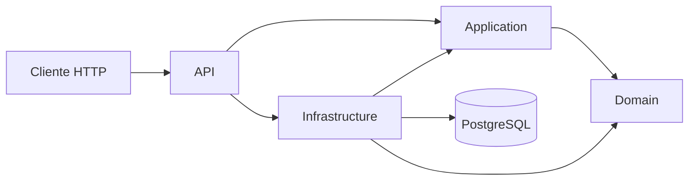
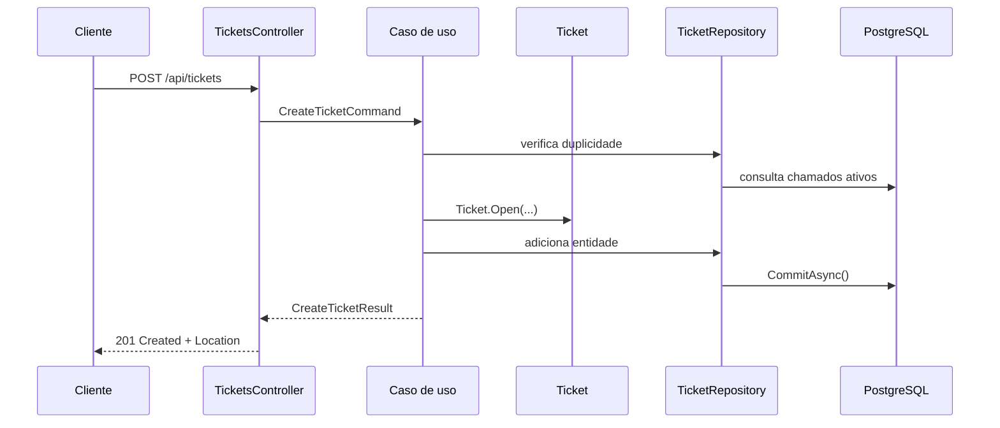
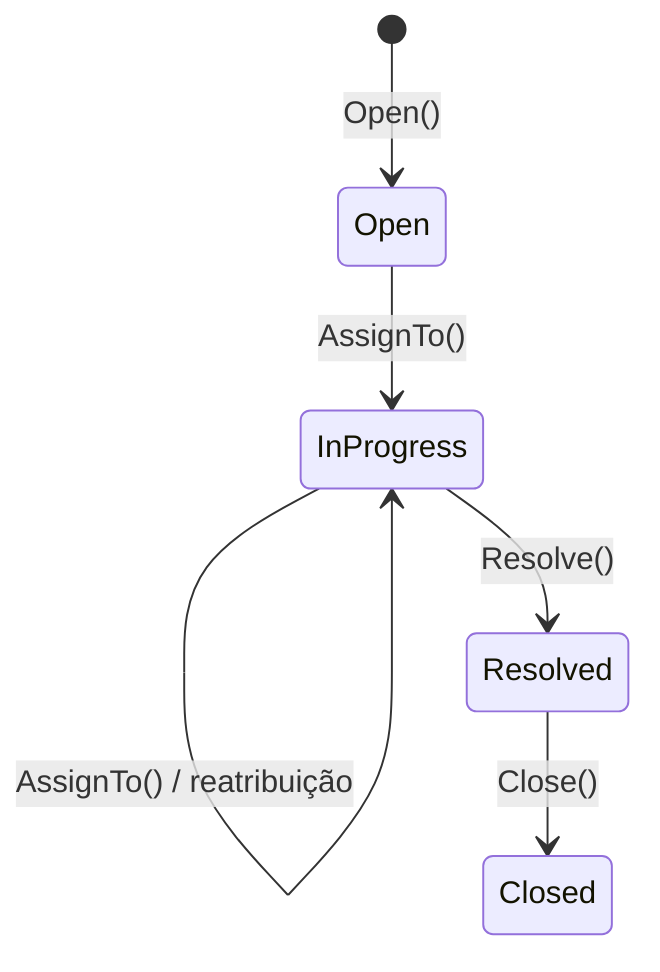

# Corporate Service Desk API


API REST para centralizar a abertura, o acompanhamento e o atendimento de chamados internos de uma organização.

O projeto é desenvolvido como laboratório de Engenharia de Software e item de portfólio. Seu foco não está apenas em entregar endpoints, mas em demonstrar modelagem de domínio, separação de responsabilidades, persistência, testabilidade, segurança e evolução arquitetural consciente.

> O objetivo é construir um monólito modular, simples de executar e preparado para evoluir sem acoplar as regras de negócio ao framework ou ao banco de dados.

---

## Visão geral

Em muitas empresas, solicitações internas ainda são registradas por e-mail, mensagens ou conversas informais. Esse processo dificulta a definição de responsabilidades, o acompanhamento do atendimento, a consulta ao histórico e a geração de indicadores.

A Corporate Service Desk API propõe uma base centralizada para esse fluxo e poderá atender interfaces web, aplicações móveis e integrações corporativas.

### O que o projeto demonstra

- desenvolvimento de APIs REST com ASP.NET Core;
- arquitetura em camadas com dependências orientadas ao domínio;
- casos de uso explícitos para escrita e leitura;
- domínio com comportamento e invariantes;
- persistência com Entity Framework Core e PostgreSQL;
- aplicação dos padrões Repository e Unit of Work;
- injeção de dependência e baixo acoplamento;
- testes unitários de domínio e aplicação;
- documentação OpenAPI/Swagger;
- execução em containers;
- registro de decisões arquiteturais por ADR.

---

## Status do projeto

O projeto está em desenvolvimento incremental. O primeiro fluxo vertical de chamados, da API até o PostgreSQL, já foi implementado.

### Implementado

- [x] solução em .NET 8 organizada em `src` e `tests`;
- [x] API com Controllers e contratos HTTP próprios;
- [x] abertura de chamado com resposta `201 Created`;
- [x] consulta de chamado por identificador;
- [x] entidade `Ticket` com regras de abertura, atribuição, resolução e encerramento;
- [x] prevenção de chamados ativos duplicados por título e solicitante;
- [x] Entity Framework Core com provedor Npgsql;
- [x] PostgreSQL e migration inicial;
- [x] Repository e Unit of Work;
- [x] Swagger/OpenAPI com comentários XML;
- [x] serialização textual de enums;
- [x] Dockerfile multi-stage;
- [x] testes unitários com xUnit e Moq;
- [x] 22 testes automatizados aprovados.

### Próximas entregas

- [ ] tratamento global de exceções com Problem Details;
- [ ] autenticação e autorização;
- [ ] endpoints para atribuir, resolver e encerrar chamados;
- [ ] listagem paginada com filtros e ordenação;
- [ ] comentários e histórico do chamado;
- [ ] testes de integração;
- [ ] logs estruturados, health checks e pipeline de CI.

---

## Usuários previstos

### Solicitante

Funcionário que registra e acompanha chamados.

Responsabilidades previstas:

- abrir chamados;
- consultar os próprios chamados;
- acompanhar o andamento;
- adicionar comentários.

### Atendente

Profissional responsável pelo tratamento das solicitações.

Responsabilidades previstas:

- consultar chamados disponíveis;
- assumir chamados;
- alterar prioridade e status;
- registrar comentários técnicos;
- resolver chamados.

### Administrador

Responsável pela administração da aplicação.

Responsabilidades previstas:

- gerenciar usuários;
- gerenciar perfis;
- associar permissões;
- visualizar todos os chamados;
- executar operações administrativas.

---

## Escopo planejado

As listas abaixo representam o escopo funcional e técnico pretendido. O estado de cada entrega é acompanhado na seção [Status do projeto](#status-do-projeto).

### Autenticação e autorização

- login com usuário e senha;
- geração e validação de JWT;
- perfis de acesso;
- permissões;
- autorização baseada em policies;
- bloqueio de usuários inativos.

### Gestão de chamados

- abertura de chamado;
- consulta por identificador;
- listagem paginada;
- atribuição a um atendente;
- alteração de prioridade;
- alteração de status;
- inclusão de comentários;
- histórico de alterações relevantes.

### Consultas

- paginação;
- ordenação;
- filtro por status;
- filtro por prioridade;
- filtro por solicitante;
- filtro por atendente;
- filtro por período;
- pesquisa textual.

### Qualidade técnica

- logs estruturados;
- tratamento global de exceções;
- respostas com Problem Details;
- Swagger/OpenAPI;
- testes unitários;
- testes de integração;
- Docker;
- pipeline de integração contínua;
- health checks.

---

## Arquitetura

O sistema é um **monólito modular organizado em camadas**, inspirado nos princípios de Clean Architecture. As dependências de código apontam para o núcleo da aplicação: o domínio não conhece ASP.NET Core, Entity Framework Core, PostgreSQL ou detalhes de entrega.


```mermaid
flowchart LR
    Client[Cliente HTTP] --> API[API]
    API --> APP[Application]
    API --> INFRA[Infrastructure]
    INFRA --> APP
    APP --> DOMAIN[Domain]
    INFRA --> DOMAIN
    INFRA --> DB[(PostgreSQL)]
```

### Direção das dependências

```text
Api              → Application
Api              → Infrastructure
Infrastructure   → Application
Infrastructure   → Domain
Application      → Domain
Domain           → nenhuma camada do sistema
```

### Responsabilidade das camadas

| Camada | Responsabilidade |
| --- | --- |
| `CorporateServiceDesk.Domain` | Entidades, enums, invariantes e transições de estado do negócio. Não depende das demais camadas. |
| `CorporateServiceDesk.Application` | Casos de uso, comandos, resultados, exceções de aplicação e abstrações de persistência. |
| `CorporateServiceDesk.Infrastructure` | EF Core, `DbContext`, mapeamentos, migrations e implementações dos repositórios. |
| `CorporateServiceDesk.Api` | Controllers, contratos HTTP, mapeamento de respostas, Swagger e composição das dependências. |

### Fluxo de uma requisição


```mermaid
sequenceDiagram
    participant C as Cliente
    participant A as TicketsController
    participant U as Caso de uso
    participant D as Ticket
    participant R as TicketRepository
    participant P as PostgreSQL

    C->>A: POST /api/tickets
    A->>U: CreateTicketCommand
    U->>R: verifica duplicidade
    R->>P: consulta chamados ativos
    U->>D: Ticket.Open(...)
    U->>R: adiciona entidade
    R->>P: CommitAsync()
    U-->>A: CreateTicketResult
    A-->>C: 201 Created + Location
```

---

## Padrões e decisões de design

### Use Case

Cada operação da aplicação é representada por uma classe dedicada, como `CreateTicketUseCase` e `QueryGetTicketByIdUseCase`. O Controller fica responsável pelo protocolo HTTP, enquanto o caso de uso coordena domínio e persistência.

### Command e Result

Os dados de entrada e saída da camada de aplicação são representados por records imutáveis, por exemplo `CreateTicketCommand` e `CreateTicketResult`. Os contratos HTTP permanecem na API e são mapeados explicitamente.

> Há separação entre operações de escrita e leitura, mas o projeto não utiliza uma implementação completa de CQRS nem depende de MediatR.

### Repository

`ITicketRepository` define as operações de persistência necessárias ao caso de uso. A implementação com EF Core fica na Infrastructure, mantendo a Application independente do provedor de banco.

### Unit of Work

`IUnitOfWork` delimita a confirmação das alterações. O `ApplicationDbContext` implementa esse contrato e executa o `SaveChangesAsync` por meio de `CommitAsync`.

### Rich Domain Model

A entidade `Ticket` protege as próprias invariantes e transições. Um chamado:

- nasce com status `Open`;
- exige identificadores, título, descrição e prioridade válidos;
- muda para `InProgress` ao ser atribuído;
- só pode ser resolvido quando está em atendimento;
- só pode ser encerrado quando está resolvido;
- registra o horário UTC do encerramento.

### Dependency Injection

Dependências são registradas no ponto de composição da API. Casos de uso marcados por `IUseCase` são descobertos por reflexão, enquanto repositórios, `DbContext`, `IUnitOfWork` e `TimeProvider` são registrados com seus ciclos de vida apropriados.

### Dependency Inversion

A Application declara interfaces como `ITicketRepository` e `IUnitOfWork`; a Infrastructure fornece as implementações. Assim, os casos de uso dependem de abstrações e podem ser testados sem banco de dados.

---

## Modelo de domínio atual

### Ticket

| Propriedade | Tipo | Regra |
| --- | --- | --- |
| `Id` | `Guid` | Gerado na abertura e diferente de vazio |
| `Title` | `string` | Obrigatório, normalizado e limitado a 160 caracteres |
| `Description` | `string` | Obrigatória, normalizada e limitada a 4.000 caracteres na persistência/API |
| `RequesterId` | `Guid` | Identifica o solicitante |
| `AssigneeId` | `Guid?` | Preenchido quando um atendente assume o chamado |
| `Priority` | `TicketPriority` | `Low`, `Medium`, `High` ou `Critical` |
| `Status` | `TicketStatus` | Estado atual do chamado |
| `OpenedAtUtc` | `DateTimeOffset` | Instante UTC de abertura |
| `ClosedAtUtc` | `DateTimeOffset?` | Preenchido no encerramento |

### Ciclo de vida implementado no domínio


```mermaid
stateDiagram-v2
    [*] --> Open: Open()
    Open --> InProgress: AssignTo()
    InProgress --> InProgress: AssignTo() / reatribuição
    InProgress --> Resolved: Resolve()
    Resolved --> Closed: Close()
```

Os enums também reservam os estados `Waiting` e `Cancelled`, que ainda não possuem transições implementadas na entidade.

---

## Endpoints disponíveis

| Método | Rota | Descrição | Resposta de sucesso |
| --- | --- | --- | --- |
| `POST` | `/api/tickets` | Abre um chamado | `201 Created` |
| `GET` | `/api/tickets/{id}` | Consulta um chamado por ID | `200 OK` |

### Criar um chamado

```http
POST /api/tickets
Content-Type: application/json

{
  "title": "Acesso à VPN indisponível",
  "description": "Não consigo estabelecer conexão com a VPN corporativa.",
  "requesterId": "7f3d9bf7-f7d8-49cc-a9d0-44b5c27f3ac4",
  "priority": "High"
}
```

Exemplo de resposta:

```http
HTTP/1.1 201 Created
Location: /api/tickets/4a032379-288d-4859-a105-0e15a763728b
```

```json
{
  "id": "4a032379-288d-4859-a105-0e15a763728b",
  "title": "Acesso à VPN indisponível",
  "description": "Não consigo estabelecer conexão com a VPN corporativa.",
  "requesterId": "7f3d9bf7-f7d8-49cc-a9d0-44b5c27f3ac4",
  "priority": "High",
  "status": "Open",
  "openedAtUtc": "2026-07-25T14:30:00+00:00"
}
```

### Consultar um chamado

```http
GET /api/tickets/4a032379-288d-4859-a105-0e15a763728b
Accept: application/json
```

---

## Tecnologias

| Categoria | Tecnologia |
| --- | --- |
| Linguagem e runtime | C# e .NET 8 |
| API | ASP.NET Core Web API com Controllers |
| Documentação | Swagger/OpenAPI e comentários XML |
| Persistência | Entity Framework Core 8.0.11 |
| Banco de dados | PostgreSQL com Npgsql 8.0.11 |
| Testes | xUnit, Moq e coverlet |
| Containers | Docker e Docker Compose |
| IDE utilizada | Visual Studio 2022 |

---

## Estrutura do repositório

```text
CorporateServiceDesk/
├── docs/
│   ├── adr/
│   ├── 01-visao-do-produto.md
│   ├── 02-requisitos-do-mvp.md
│   ├── 03-matriz-de-permissoes.md
│   └── 04-user-stories.md
├── src/
│   ├── CorporateServiceDesk.Api/
│   ├── CorporateServiceDesk.Application/
│   ├── CorporateServiceDesk.Domain/
│   └── CorporateServiceDesk.Infrastructure/
├── tests/
│   └── CorporateServiceDesk.UnitTests/
├── CorporateServiceDesk.sln
├── compose.yaml
└── README.md
```

---

## Como executar

### Pré-requisitos

- .NET 8 SDK;
- PostgreSQL;
- Docker Desktop, caso o banco ou a API sejam executados em container;
- Git.

### 1. Configurar a conexão com o banco

Para execução local, use o Secret Manager e não versione credenciais:

```powershell
dotnet user-secrets set `
  "ConnectionStrings:DefaultConnection" `
  "Host=127.0.0.1;Port=55432;Database=corporate_service_desk;Username=corporate_service_desk;Password=SUA_SENHA_LOCAL" `
  --project src/CorporateServiceDesk.Api
```

A porta deve corresponder à porta publicada pela sua instância local do PostgreSQL.

### 2. Restaurar e compilar

```powershell
dotnet restore
dotnet build
```

### 3. Aplicar as migrations

```powershell
dotnet ef database update `
  --project src/CorporateServiceDesk.Infrastructure `
  --startup-project src/CorporateServiceDesk.Api `
  --context ApplicationDbContext
```

### 4. Executar a API

```powershell
dotnet run --project src/CorporateServiceDesk.Api
```

No perfil HTTP padrão, o Swagger fica disponível em:

```text
http://localhost:5278/swagger
```

### 5. Executar os testes

```powershell
dotnet test
```

Resultado validado no estado atual:

```text
Total: 22
Aprovados: 22
Falhas: 0
```

---

## Estratégia de testes

Os testes unitários não dependem de rede ou banco de dados.

### Domínio

- criação e normalização de chamados;
- validação de título, descrição, solicitante e prioridade;
- atribuição e reatribuição;
- resolução;
- encerramento;
- proteção contra transições inválidas.

### Aplicação

- persistência de um novo chamado;
- normalização antes da consulta de duplicidade;
- bloqueio de chamado ativo duplicado;
- retorno do resultado criado;
- propagação de `CancellationToken`;
- interação com Repository e Unit of Work.

`TimeProvider` é injetado para tornar regras temporais determinísticas e facilitar testes.

---

## Persistência

O `ApplicationDbContext` mapeia `Ticket` para a tabela `tickets`. Os nomes das colunas seguem `snake_case`, e prioridade/status são armazenados como texto para melhorar a legibilidade do banco.

Índices atuais:

- `requester_id`;
- `assignee_id`;
- índice composto por `status` e `opened_at_utc`.

As migrations ficam em:

```text
src/CorporateServiceDesk.Infrastructure/Persistence/Migrations
```

A escolha do PostgreSQL está documentada no ADR `0002-Uso do PostgreSQL.md`.

---

## Segurança

### Práticas já adotadas

- configuração de conexão externa ao `appsettings.json` principal;
- suporte ao Secret Manager do ASP.NET Core;
- `.env` ignorado pelo Git;
- propriedades das entidades com alteração controlada;
- validação de entrada na borda HTTP e no domínio;
- enums enviados como texto, sem aceitar valores numéricos arbitrários;
- execução do container com usuário não privilegiado da imagem .NET.

### Planejado

- hash seguro de senhas;
- autenticação por JWT;
- autorização baseada em perfis, permissões e policies;
- validação de acesso ao recurso;
- proteção contra exposição de tokens, senhas e stack traces;
- configuração de CORS conforme os clientes reais.

---

## Documentação complementar

- `docs/01-visao-do-produto.md`: contexto, objetivos e atores;
- `docs/02-requisitos-do-mvp.md`: requisitos funcionais e não funcionais;
- `docs/03-matriz-de-permissoes.md`: permissões planejadas por perfil;
- `docs/04-user-stories.md`: histórias e critérios de aceite;
- `docs/adr/0001-arquitetura-inicial.md`: decisão sobre a arquitetura;
- `0002-Uso do PostgreSQL.md`: decisão sobre o banco de dados;
- `0003-configuracao-segredo-execucao-local.md`: configuração local e diagnóstico de conexão.

---

## Roadmap

### Fluxo de chamados

- [x] modelar `Ticket`;
- [x] abrir chamado;
- [x] consultar chamado por identificador;
- [x] persistir com EF Core e PostgreSQL;
- [ ] atribuir chamado por endpoint;
- [ ] resolver e encerrar chamado por endpoint;
- [ ] adicionar comentários e histórico;
- [ ] implementar listagem, paginação e filtros.

### Segurança

- [ ] modelar usuários;
- [ ] implementar hash de senha;
- [ ] implementar login e JWT;
- [ ] implementar perfis e permissões;
- [ ] criar policies de autorização.

### Qualidade e operação

- [x] testes unitários do domínio;
- [x] testes unitários do caso de uso de abertura;
- [ ] testes de integração;
- [ ] Problem Details e tratamento global de exceções;
- [ ] logs estruturados e Correlation ID;
- [ ] health checks;
- [ ] pipeline de integração contínua;
- [ ] deploy e observabilidade.

---

## Limitações atuais

- autenticação e autorização ainda não foram implementadas;
- erros de domínio/aplicação ainda não são convertidos globalmente em respostas HTTP padronizadas;
- apenas abertura e consulta por ID estão expostas na API;
- atribuição, resolução e encerramento existem no domínio, mas ainda não possuem endpoints;
- listagem, filtros, comentários e histórico ainda não estão disponíveis;
- não há testes de integração ou pipeline de CI;
- a configuração do Docker Compose ainda está em evolução.

---

## Decisões técnicas

- **Monólito modular:** adequado ao tamanho atual e com limites internos explícitos.
- **Controllers:** tornam contratos HTTP, validação, documentação e autorização visíveis.
- **EF Core + PostgreSQL:** oferecem produtividade, migrations e um banco relacional robusto.
- **Domínio sem dependência de framework:** mantém as regras centrais isoladas e testáveis.
- **Sem MediatR:** os casos de uso são resolvidos diretamente pela injeção de dependência.
- **Sem microsserviços:** a complexidade operacional não se justifica no estágio atual.
- **Docker desde a fundação:** reduz diferenças entre ambientes e valida a execução em Linux.

---

## Evolução do projeto

Este README acompanha o código entregue. Novas funcionalidades, métricas, diagramas e decisões serão adicionados conforme forem implementados e validados, evitando apresentar itens planejados como concluídos.

## Autor

**Peterson Benhame**

Projeto desenvolvido como laboratório prático de Engenharia de Software, arquitetura e desenvolvimento de APIs corporativas com .NET.
