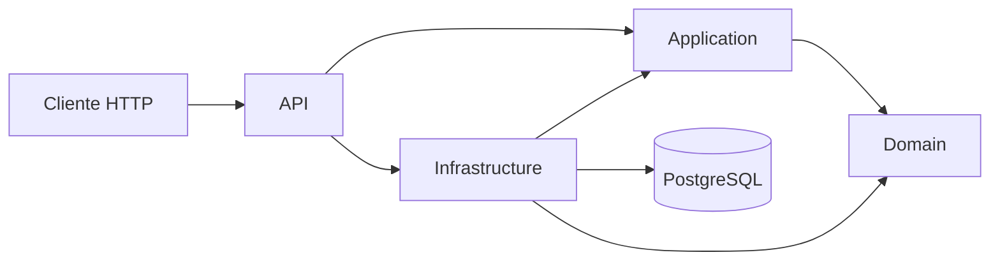
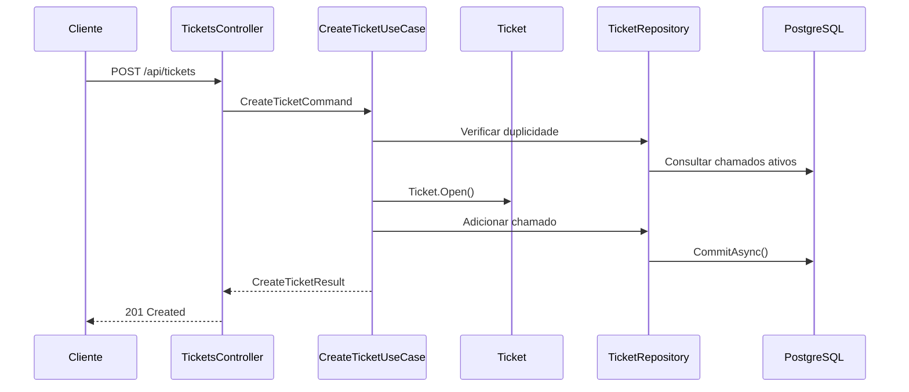
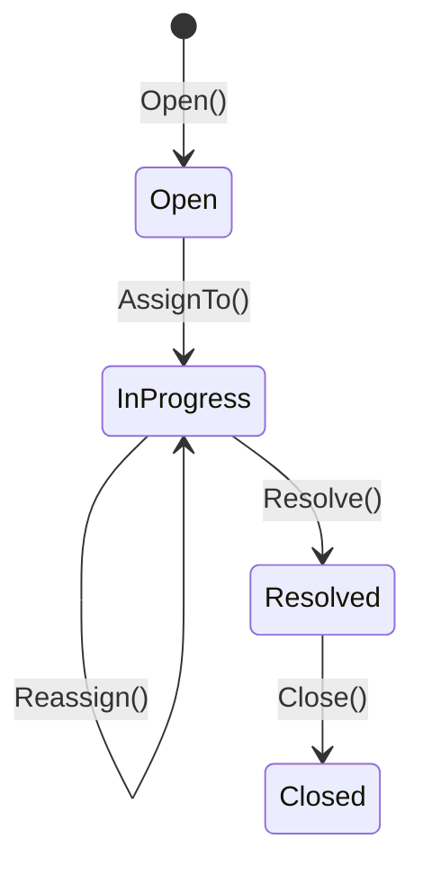

# Corporate Service Desk API

[](https://github.com/Peterson-Benhame/CorporateServiceDesk/actions/workflows/ci.yml)
[](https://github.com/Peterson-Benhame/CorporateServiceDesk/releases)


API REST para gerenciamento de chamados corporativos, construída com .NET 8, ASP.NET Core, Entity Framework Core, PostgreSQL e Docker.

O projeto funciona como laboratório de Engenharia de Software e portfólio backend. Ele demonstra domínio, persistência, testes automatizados, segurança de dependências, migrations, containers, CI/CD, versionamento e deploy controlado.

## Demonstração

| Recurso | Endereço |
| --- | --- |
| API | [corporateservicedesk.onrender.com](https://corporateservicedesk.onrender.com) |
| Swagger | [corporateservicedesk.onrender.com/swagger](https://corporateservicedesk.onrender.com/swagger) |
| Health | [corporateservicedesk.onrender.com/health](https://corporateservicedesk.onrender.com/health) |
| Version | [corporateservicedesk.onrender.com/version](https://corporateservicedesk.onrender.com/version) |
| Pipeline | [GitHub Actions](https://github.com/Peterson-Benhame/CorporateServiceDesk/actions) |
| Imagem | [GitHub Container Registry](https://github.com/Peterson-Benhame/CorporateServiceDesk/pkgs/container/corporate-service-desk-api) |

> O plano de demonstração do Render pode suspender o serviço após inatividade. O primeiro acesso pode demorar.

## Problema atendido

Solicitações internas registradas por e-mail, mensagens e planilhas dificultam acompanhamento, definição de responsáveis e rastreabilidade.

A Corporate Service Desk API fornece base para:

- abertura e acompanhamento de chamados;
- pesquisa simples e avançada;
- atribuição e ciclo de vida;
- histórico de alterações;
- integrações web, mobile e corporativas.

## Recursos implementados

- criação de chamados;
- consulta por identificador;
- listagem paginada;
- filtros por status, prioridade, solicitante, atendente e período;
- pesquisa textual e critérios dinâmicos;
- prevenção de chamados ativos duplicados;
- regras de atribuição, resolução e encerramento no domínio;
- Problem Details e tratamento global de exceções;
- Swagger/OpenAPI;
- PostgreSQL com Entity Framework Core;
- migrations versionadas e migration bundle;
- testes unitários e de integração;
- cobertura mínima obrigatória;
- Docker e Docker Compose;
- health check e identificação do commit implantado;
- container smoke test com PostgreSQL real no CI;
- CodeQL, Dependency Review, Trivy e Dependabot;
- publicação de imagens no GHCR;
- deploy protegido no Render;
- versionamento SemVer e changelog automatizado;
- ADRs e documentação operacional.

## Arquitetura

O sistema está estruturado como monólito modular em camadas, inspirado em Clean Architecture.


```mermaid
flowchart LR
    CLIENT[Cliente HTTP] --> API[API]
    API --> APPLICATION[Application]
    API --> INFRASTRUCTURE[Infrastructure]
    INFRASTRUCTURE --> APPLICATION
    APPLICATION --> DOMAIN[Domain]
    INFRASTRUCTURE --> DOMAIN
    INFRASTRUCTURE --> DATABASE[(PostgreSQL)]
```

### Dependências

```text
API              → Application
API              → Infrastructure
Infrastructure   → Application
Infrastructure   → Domain
Application      → Domain
Domain           → nenhuma camada interna
```

| Projeto | Responsabilidade |
| --- | --- |
| `CorporateServiceDesk.Domain` | Entidades, enums, invariantes e regras de negócio. |
| `CorporateServiceDesk.Application` | Casos de uso, resultados, validações e abstrações. |
| `CorporateServiceDesk.Infrastructure` | EF Core, PostgreSQL, migrations e repositórios. |
| `CorporateServiceDesk.Api` | Controllers, contratos HTTP, Swagger e composição. |

## Fluxo de criação de chamado


```mermaid
sequenceDiagram
    participant Client as Cliente
    participant Controller as TicketsController
    participant UseCase as CreateTicketUseCase
    participant Domain as Ticket
    participant Repository as TicketRepository
    participant Database as PostgreSQL

    Client->>Controller: POST /api/tickets
    Controller->>UseCase: CreateTicketCommand
    UseCase->>Repository: Verificar duplicidade
    Repository->>Database: Consultar chamados ativos
    UseCase->>Domain: Ticket.Open()
    UseCase->>Repository: Adicionar chamado
    Repository->>Database: CommitAsync()
    UseCase-->>Controller: CreateTicketResult
    Controller-->>Client: 201 Created
```

## Modelo de domínio


```mermaid
stateDiagram-v2
    [*] --> Open: Open()
    Open --> InProgress: AssignTo()
    InProgress --> InProgress: Reassign()
    InProgress --> Resolved: Resolve()
    Resolved --> Closed: Close()
```

Regras principais:

- título, descrição e solicitante são obrigatórios;
- título limitado a 160 caracteres;
- descrição limitada a 4.000 caracteres;
- ticket nasce como `Open`;
- atribuição altera para `InProgress`;
- somente ticket em atendimento pode ser resolvido;
- somente ticket resolvido pode ser encerrado;
- tickets ativos duplicados são bloqueados;
- datas são persistidas em UTC.

## Endpoints

| Método | Rota | Descrição |
| --- | --- | --- |
| `POST` | `/api/tickets` | Cria um chamado. |
| `GET` | `/api/tickets` | Lista com paginação e filtros. |
| `POST` | `/api/tickets/search` | Pesquisa avançada. |
| `GET` | `/api/tickets/{id}` | Consulta por identificador. |
| `GET` | `/health` | Estado, versão e commit da aplicação. |
| `GET` | `/version` | Versão, commit e ambiente implantados. |

### Criar chamado

```http
POST /api/tickets
Content-Type: application/json

{
  "title": "Acesso à VPN indisponível",
  "description": "Não consigo estabelecer conexão com a VPN corporativa.",
  "requesterId": "7f3d9bf7-f7d8-49cc-a9d0-44b5c27f3ac4",
  "priority": "High"
}
```

### Listar chamados

```http
GET /api/tickets?page=1&pageSize=10&countTotal=true&status=Open&priority=High&search=VPN
Accept: application/json
```

### Pesquisa avançada

```http
POST /api/tickets/search
Content-Type: application/json

{
  "page": 1,
  "pageSize": 10,
  "countTotal": true,
  "sortBy": "OpenedAtUtc",
  "sortDirection": "Descending",
  "criteria": [
    {
      "column": "Status",
      "operator": "Equals",
      "value": "Open",
      "logicalOperator": "And"
    }
  ]
}
```

## Tecnologias

| Categoria | Tecnologia |
| --- | --- |
| Linguagem | C# |
| Runtime | .NET 8 |
| API | ASP.NET Core Web API |
| Persistência | Entity Framework Core |
| Banco | PostgreSQL 16 |
| Testes | xUnit, Moq, Coverlet e Testcontainers |
| Containers | Docker e Docker Compose |
| CI/CD | GitHub Actions |
| Segurança | CodeQL, Dependency Review e Trivy |
| Dependências | Dependabot |
| Versionamento | Release Please e SemVer |
| Registry | GitHub Container Registry |
| Hospedagem | Render |

## Estrutura

```text
CorporateServiceDesk/
├── .github/
│   ├── workflows/
│   │   ├── ci.yml
│   │   ├── release.yml
│   │   └── security.yml
│   ├── dependabot.yml
│   ├── CODEOWNERS
│   └── pull_request_template.md
├── docs/
│   ├── adr/
│   └── ci-cd/
├── src/
│   ├── CorporateServiceDesk.Api/
│   ├── CorporateServiceDesk.Application/
│   ├── CorporateServiceDesk.Domain/
│   └── CorporateServiceDesk.Infrastructure/
├── tests/
│   ├── CorporateServiceDesk.Domain.UnitTests/
│   ├── CorporateServiceDesk.Application.UnitTests/
│   └── CorporateServiceDesk.IntegrationTests/
├── .env.example
├── CHANGELOG.md
├── CONTRIBUTING.md
├── SECURITY.md
├── CorporateServiceDesk.sln
├── docker-compose.yml
├── release-please-config.json
└── README.md
```

## Executar com Docker

Pré-requisitos:

- Docker Desktop;
- Docker Compose;
- Git.

```powershell
git clone https://github.com/Peterson-Benhame/CorporateServiceDesk.git
cd CorporateServiceDesk
Copy-Item .env.example .env
docker compose -f docker-compose.yml up --build -d api
```

O entrypoint da imagem aplica as migrations pendentes antes de iniciar a API.

Acesse:

```text
Swagger: http://localhost:8080/swagger
Health:  http://localhost:8080/health
Version: http://localhost:8080/version
```

Encerrar:

```powershell
docker compose -f docker-compose.yml down
```

Remover também o volume local:

```powershell
docker compose -f docker-compose.yml down -v
```

## Migrations locais

Criar:

```powershell
docker compose -f docker-compose.yml --profile tools run --rm migrations "dotnet tool restore && dotnet ef migrations add NomeDaMigration --project src/CorporateServiceDesk.Infrastructure/CorporateServiceDesk.Infrastructure.csproj --startup-project src/CorporateServiceDesk.Api/CorporateServiceDesk.Api.csproj --context ApplicationDbContext"
```

Aplicar no PostgreSQL local:

```powershell
docker compose -f docker-compose.yml --profile tools run --rm migrations "dotnet tool restore && dotnet ef database update --project src/CorporateServiceDesk.Infrastructure/CorporateServiceDesk.Infrastructure.csproj --startup-project src/CorporateServiceDesk.Api/CorporateServiceDesk.Api.csproj --context ApplicationDbContext"
```

O desenvolvedor não recebe acesso ao banco de produção. No Render, o migration bundle usa a connection string injetada diretamente no container.

## Testes

```powershell
dotnet tool restore
dotnet restore CorporateServiceDesk.sln --locked-mode
dotnet build CorporateServiceDesk.sln --configuration Release --no-restore
dotnet test CorporateServiceDesk.sln --configuration Release --no-build
```

Os testes de integração usam Testcontainers e exigem Docker.

Cobertura mínima:

| Métrica | Mínimo |
| --- | --- |
| Linhas | 60% |
| Branches | 40% |

Migrations do EF não entram no cálculo.

## CI/CD

```mermaid
flowchart TD
    PUSH[Push ou Pull Request] --> BUILD[Restore, build e testes]
    BUILD --> COVERAGE[Cobertura mínima]
    COVERAGE --> EF[Modelo EF atualizado]
    EF --> IMAGE[Build da imagem final]
    IMAGE --> SMOKE[PostgreSQL temporário + container real]
    SMOKE --> MIGRATION[Migration bundle aplicado]
    MIGRATION --> SECURITY[Trivy]
    SECURITY --> GHCR[Publicação no GHCR]
    GHCR --> APPROVAL[Aprovação production]
    APPROVAL --> RENDER[Render recebe o commit exato]
    RENDER --> VERIFY[/version + /health com o mesmo SHA]
```

O GitHub Actions não acessa o PostgreSQL de produção. A migration roda dentro da imagem no Render.

O smoke test do CI valida exatamente:

- `docker-entrypoint.sh`;
- `efbundle`;
- criação de tabelas;
- registro em `__EFMigrationsHistory`;
- inicialização da API;
- `/health`;
- `/version`;
- SHA da imagem.

## Segurança

Controles implementados:

- CodeQL para C#;
- Dependency Review em PRs;
- Trivy no repositório e na imagem;
- bloqueio de secrets detectados;
- bloqueio de vulnerabilidades críticas corrigíveis;
- Dependabot para NuGet, Actions e Docker;
- container executado sem usuário root;
- secrets fora do código;
- ambiente `production` protegido;
- Secret Scanning e Push Protection do GitHub.

Consulte [SECURITY.md](SECURITY.md).

## Releases

O Release Please cria changelog, tag e GitHub Release com base em Conventional Commits.

Exemplos:

```text
fix: correct ticket ordering
feat: add ticket assignment
feat!: change public ticket contract
```

As imagens recebem tags de commit e SemVer.

Consulte [docs/ci-cd/releases.md](docs/ci-cd/releases.md).

## Documentação

| Documento | Conteúdo |
| --- | --- |
| `docs/01-visao-do-produto.md` | Contexto, objetivos e atores. |
| `docs/02-requisitos-do-mvp.md` | Requisitos funcionais e não funcionais. |
| `docs/03-matriz-de-permissoes.md` | Permissões planejadas. |
| `docs/04-user-stories.md` | Histórias e critérios de aceite. |
| `docs/adr` | Decisões arquiteturais. |
| `docs/ci-cd/branch-protection.md` | Proteção da master. |
| `docs/ci-cd/render-production.md` | Deploy e migrations no Render. |
| `docs/ci-cd/releases.md` | SemVer e releases. |

## Roadmap

### Chamados

- [x] domínio de chamados;
- [x] criação e consulta;
- [x] paginação e filtros;
- [x] pesquisa avançada;
- [x] prevenção de duplicidade;
- [ ] atribuição;
- [ ] resolução;
- [ ] encerramento;
- [ ] comentários;
- [ ] histórico completo.

### Usuários e empresas

- [ ] cadastro e login;
- [ ] JWT e refresh token;
- [ ] empresas;
- [ ] vínculo usuário-empresa;
- [ ] perfis e permissões;
- [ ] isolamento por empresa.

### Operação e qualidade

- [x] testes unitários e de integração;
- [x] cobertura mínima;
- [x] health e version endpoint;
- [x] Docker;
- [x] migrations automatizadas no container;
- [x] container smoke test;
- [x] GHCR;
- [x] deploy no Render;
- [x] CodeQL, Trivy e Dependabot;
- [x] SemVer e changelog automático;
- [ ] logs estruturados;
- [ ] Correlation ID;
- [ ] métricas e observabilidade;
- [ ] ambiente de staging.

## Autor

**Peterson Benhame**

Desenvolvedor de Software Sênior com experiência em C#, .NET, ASP.NET Core, APIs REST, sistemas corporativos, arquitetura e integrações.

[GitHub](https://github.com/Peterson-Benhame)
